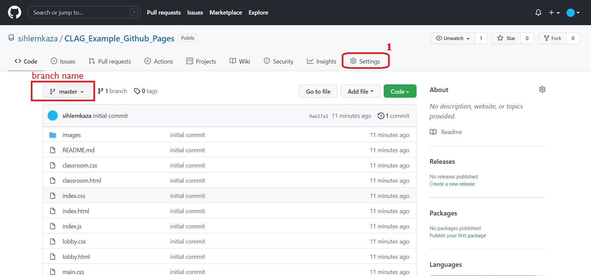
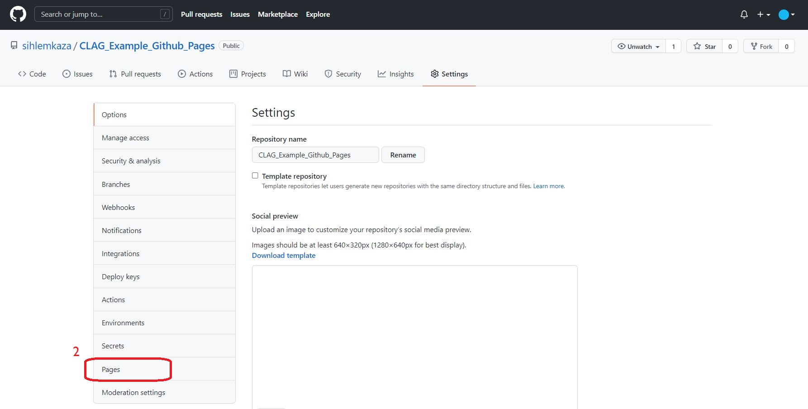
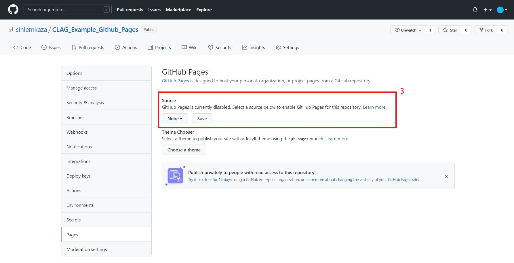
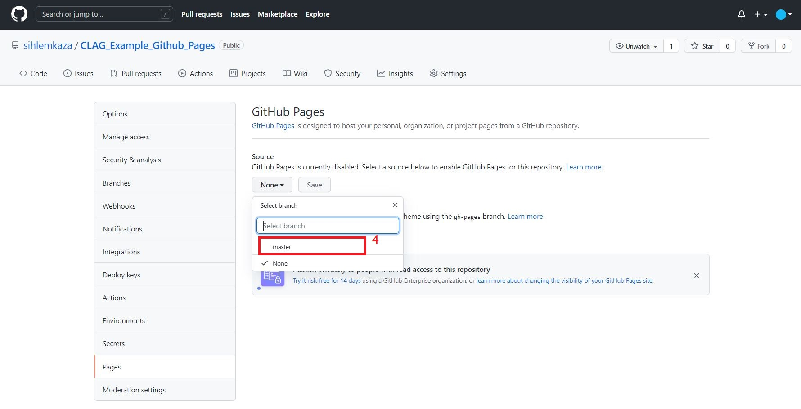
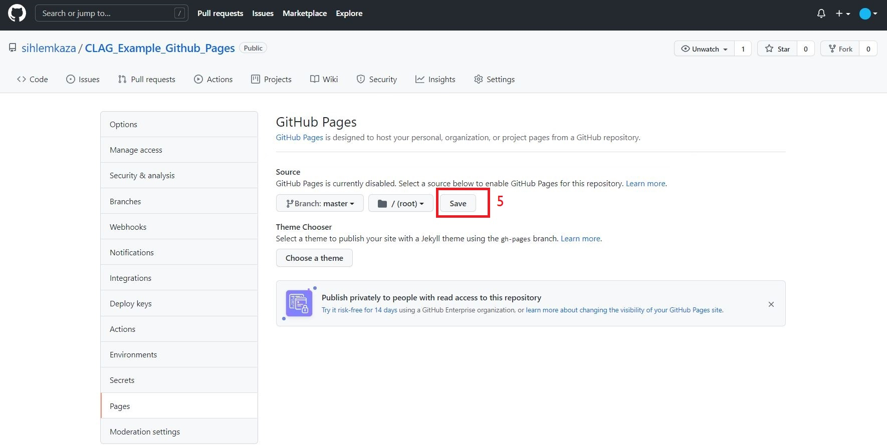
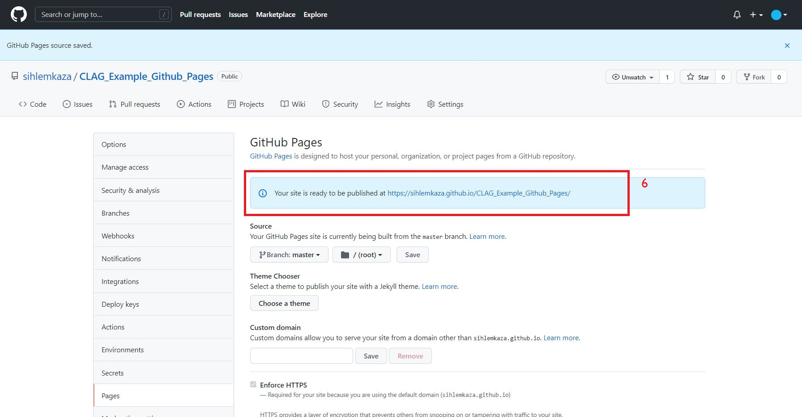
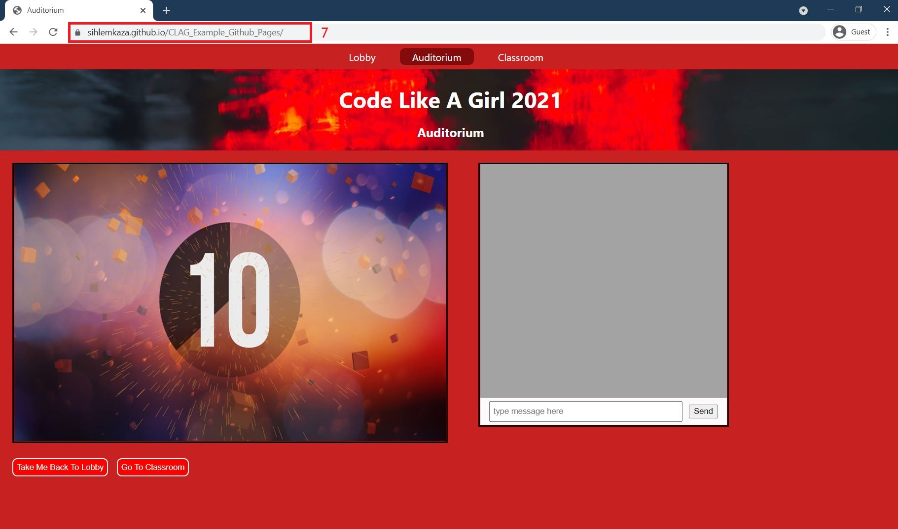

# Hosting Your HTML using GitHub Pages
## Instructions for CLAG Classroom 2

__Note__: These example HTML pages are best suited for desktop browsers and do not change to accomodate mobile screen sizes well.

When you are ready to host your web pages using GitHub pages, first make sure that you have pushed all your code to your chosen branch. For this example, the code that needs to be published exists on the __master__ branch.

Step 0: Go to the repository that contains the code for your pages. There should be an __index.html__ file in the root of the branch.

Step 1: Go to the __Settings__ tab in your repository

Step 2: Once on the __Settings__ tab, on the left hand menu, click on the __Pages__
 

Step 3: Once you are on __Pages__, under the Github Pages title you will see a Sources section. 
 

Step 4: Click on the dropdown element that has the "None" option and a list of branches that exist in the repository should be available to pick from. If the code you want to host is on the master branch choose it or the name of the branch you want to use. 
 

Step 5: After selecting your branch, a __"save"__ button should appear. Click on this save button to confirm that you want to use the code in your selected branch in your website. 
 

Step 6: After clicking on the save button, a url for your website will be displayed on the current page you are on. It will be in the format __https://{your-github-username}.github.io/{name-of-repository}__ . Click on the provided url and you will be redirected to your github hosted website.

Step 7: After having clicked on the generated url, you should be able to see that the browser displays your url for your page

__END__
